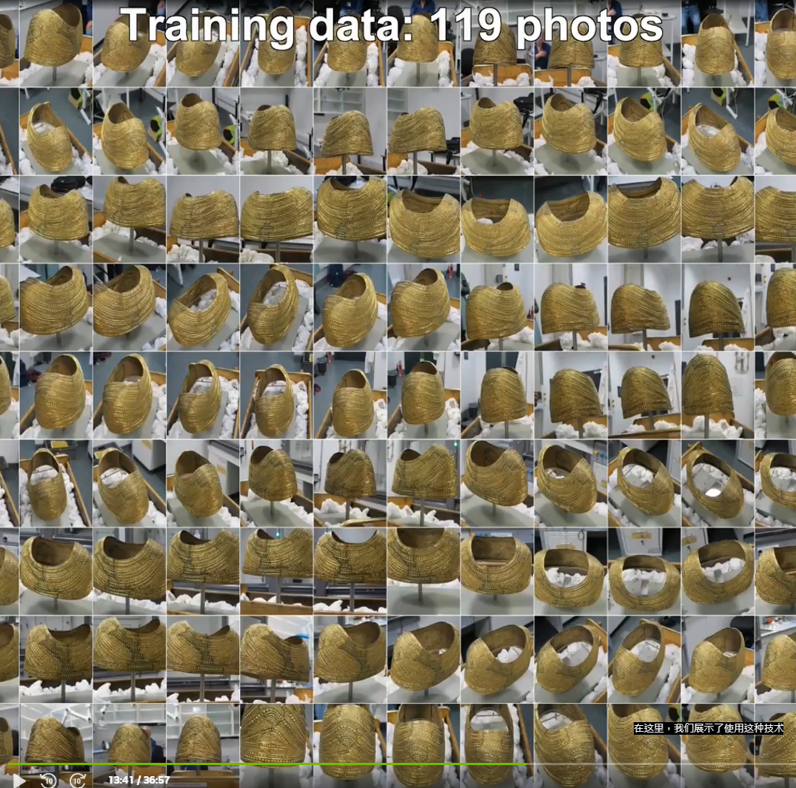
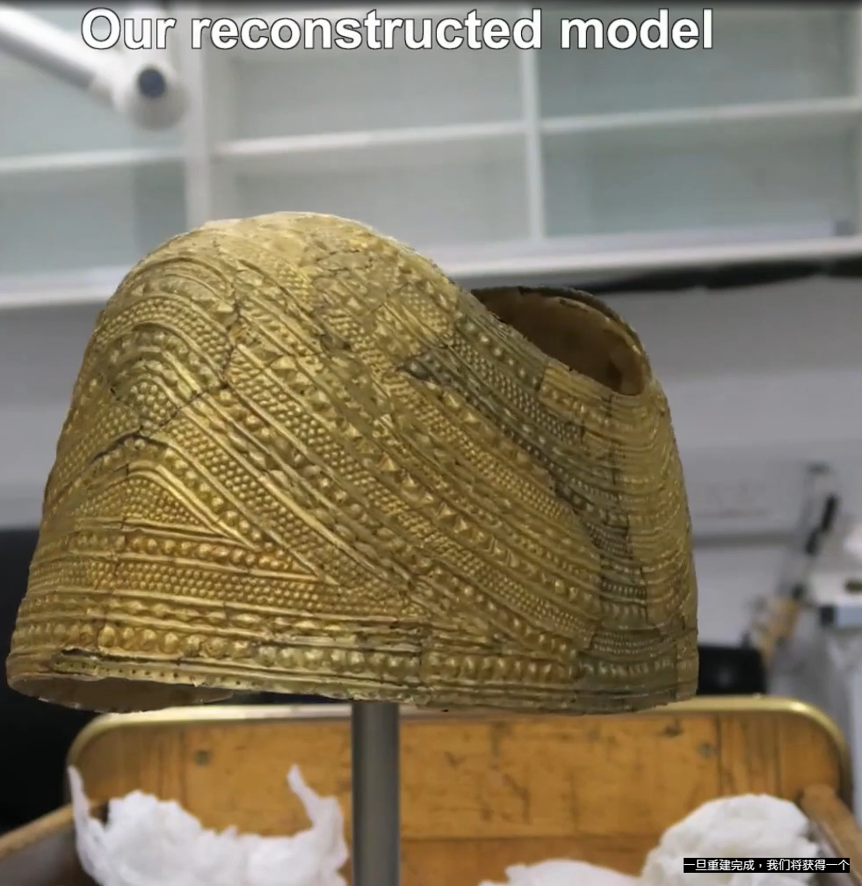

# 3D by AI: Using Generative AI and NeRFs for Building Virtual Worlds, with Q&A in Japanese [S52163a]

### instant-ngp
instanat-npg can use images to render 3D object, but the techmech still has some limit.
1. If wanting to render a good quality object, it takes lots of times.
2. The rendering quality will be effected by image's quality like noses. 

#### The images used for render 3D objects
 

#### The output of rendered objects
 