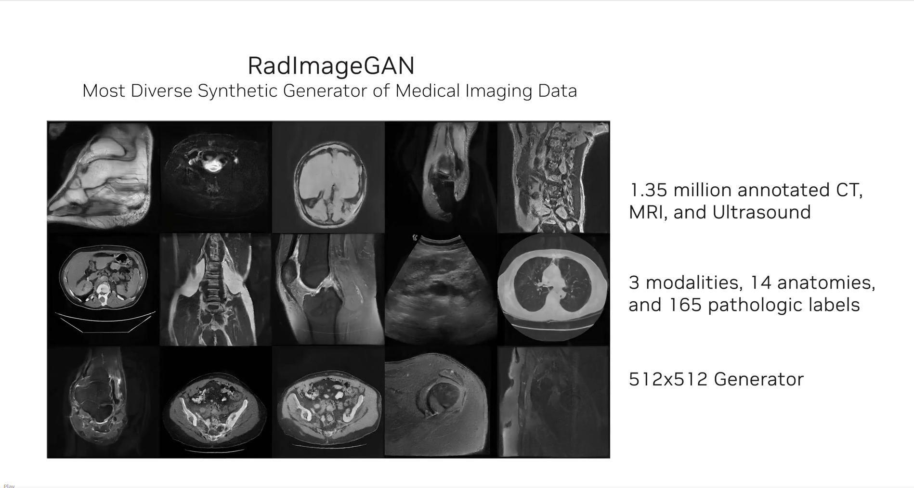

# Accelerating Generative AI in Biology and Healthcare [S51257]

## MonAI:
Description: a framework for building and deploying medical AI. Support Active learning labeling, synthetic data generation, self supervised learning, federated learning, clinical deployment.

### Synthetic data generation
Use diffusion model to generate Synthetic data. Generate medical images of the human anatomy. Trained on U.K. Biobank dataset.

hardware: DGX
software: MonAI api

### AI Model
#### RedImageGAN model 
Most diverse synthetic generator of medical imaging data. This model already on Nvidia NGC.
  

### use case: 
#### medtronic: 
GI Genius intelligent module + Holoscan
description: edge side computing detect polyp(息肉)
