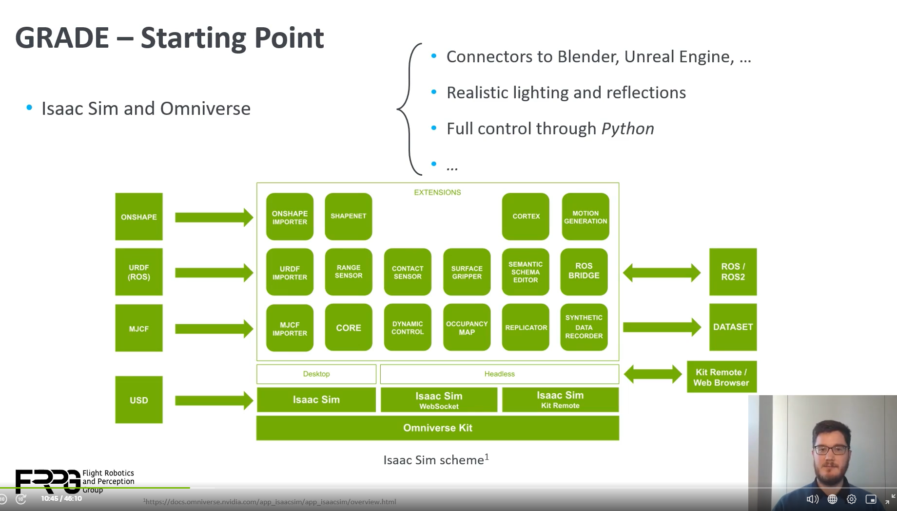

# Generate Synthetic Data of Dynamic Environments With a Custom Isaac Sim-Based Framework [S51570]

# Nvidia issac sim
## Grade
 GRADE is a system I developed to seamlessly manage the Isaac Sim simulation software to Generate Realistic Animated Dynamic Environments for Robotics Research.

### grade main componets
1. Readlistic Environmnets
2. Animaton Assets
3. Custom robots
4. A Customizable pipeline
5. Additional processing tools

### grade software pipeline
1. create environment
* Blender
* Unreal Engine
* Digital twin
2. Convert to USD format
3. Load it into Isaac Sim
4. Using sdk to set environment and camera to generate dataset

#### Verify
yolo people detection:
1. Train on synthetic data -> fine tune on S-coco dataset and full coco dataset
2. Train on S-coco dataset and full coco dataset

**Result: 1. is more accurate than 2.**

 ## reference
 [https://github.com/eliabntt/GRADE-RR](https://github.com/eliabntt/GRADE-RR)